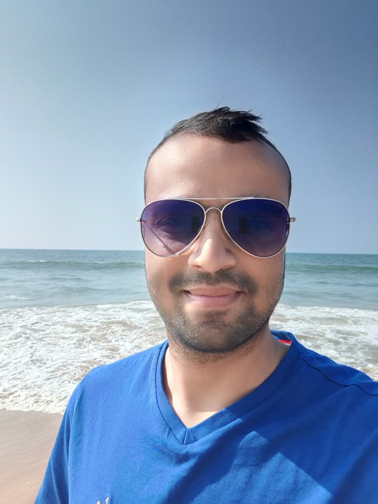

 

Utkrisht previously held a position at Nutanix from 2020 to 2022 as an SRE where his work primarily revolved around troubleshooting issues on Nutanix stack. He is skilled in resolving issues related to Networking, Hardware, Virtualisation/Hypervisors, Storage on (AHV/ESXi/Hyper-V).

Before joining Nutanix he graduated with a major in CSE in 2020 from KIIT, BBSR, Odisha.

He is primarily focussed in Computer Systems(Architecture & OS). Currently he is starting his research career in the same field. 

